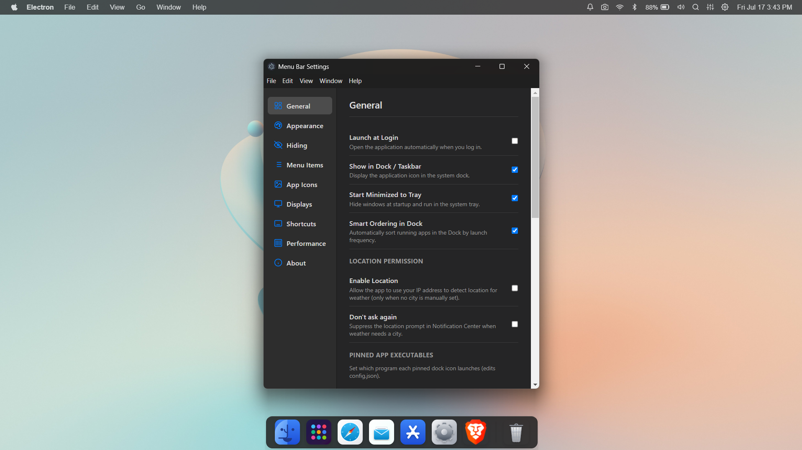

# 🚀 YourDock

<div align="center">

> **A modern macOS-inspired Dock and Menu Bar for Windows & Linux built with Electron.js**


**Lightweight • Beautiful • Customizable • Native Feel**

</div>

---

## 📖 Overview

**YourDock** is a lightweight desktop dock inspired by **macOS**, designed for **Windows** and **Linux**. It provides a smooth application launcher, customizable dock, and a modern top menu bar while maintaining low RAM usage.

Built entirely using:

- ⚡ Electron.js
- 🌐 HTML5
- 🎨 CSS3
- 📜 Vanilla JavaScript

No frontend frameworks are used, making the project easy to understand, customize, and extend.

---

# 📷 Preview

Place your screenshot inside the project root.





---

# ✨ Features

## 🖥 Dock

- macOS inspired dock
- Smooth hover magnification
- Running application indicators
- Pin favorite applications
- Drag & reorder dock icons
- Launch applications directly
- Smart app ordering
- Auto hide dock
- Dock transparency
- Blur effects
- Rounded modern design
- Lightweight performance
- Native system integration

---

## 📌 Menu Bar

- macOS style top menu bar
- System tray integration
- Clock & Date
- Battery Indicator
- WiFi Status
- Bluetooth Indicator
- Volume Control
- Notifications
- Application Menus
- Quick Access Controls

---

## ⚙ Settings

The application includes a modern Settings page with multiple configuration categories.

### General

- Launch at Login
- Show in Dock / Taskbar
- Start Minimized to Tray
- Smart Ordering in Dock
- Enable Location
- Location Permission
- Pinned App Executables

---

### Appearance

- Light Theme
- Dark Theme
- Accent Colors
- Blur Effects
- Transparency
- Rounded Corners
- Dock Size
- Icon Size

---

### Hiding

- Auto Hide Dock
- Auto Hide Menu Bar
- Hide Delay
- Reveal Animation
- Intelligent Hide

---

### Menu Items

- Customize Menu Bar
- Rearrange Items
- Show/Hide Icons
- Quick Toggles

---

### App Icons

- Change Dock Icons
- Custom Icons
- Icon Labels
- Icon Animation
- Indicator Style

---

### Displays

- Multi Monitor Support
- Dock Position
- Primary Display
- Display Scaling
- Auto Detect Displays

---

### Shortcuts

- Keyboard Shortcuts
- Global Hotkeys
- Open Dock
- Open Settings
- Launch Applications

---

### Performance

- Hardware Acceleration
- Animation Speed
- Memory Optimization
- Low Power Mode
- Startup Optimization

---

### About

- Version Information
- Updates
- Credits
- License
- Project Information

---


# 🛠 Tech Stack

| Technology | Usage |
|------------|------|
| Electron.js | Desktop Application |
| HTML5 | UI Structure |
| CSS3 | Styling |
| JavaScript | Application Logic |

---

# 📂 Project Structure

```
dock
├── Demo.png
├── README.md
├── about.html
├── appscanner.js
├── build
│   ├── icon.ico
│   └── icon.png
├── closeOnEscape.js
├── configPaths.js
├── controlcenter-preload.js
├── controlcenter.html
├── devToolsBlacklist.json
├── dock
│   ├── apps.json
│   ├── config.json
│   ├── drawer-preload.js
│   ├── drawer.html
│   ├── icons
│   ├── icons-cache
│   ├── index.html
│   ├── main.js
│   ├── package.json
│   └── preload.js
├── experimental-flags.json
├── focusForwarder.js
├── forcequit.html
├── get_request.js
├── get_step0.js
├── index.html
├── list_inputs.js
├── main.js
├── notificationcenter-preload.js
├── notificationcenter.html
├── original_request.txt
├── original_request_full.txt
├── package.json
├── preload.js
├── screenshot-overlay-preload.js
├── screenshot-overlay.html
├── screenshot-toast-preload.js
├── screenshot-toast.html
├── screenshot.js
├── settings-preload.js
├── settings.html
├── settings.json
├── spotlight-preload.js
├── spotlight.html
├── startupVisibility.js
├── tests
│   ├── appscanner.test.js
│   ├── config.test.js
│   ├── devToolsBlacklist.test.js
│   ├── dock-animations.test.js
│   ├── focusForwarder.test.js
│   ├── public-safe.test.js
│   └── startupVisibility.test.js
├── theme-export.js
├── weather.js
└── welcome.html
```

---

# 🚀 Installation
1> 📥 Download

Download the latest version from the **Releases** page:

https://github.com/SharadCodes15/YourDock/releases/latest

2 >
Clone the repository

```bash
git clone https://github.com/SharadCodes15/YourDock.git
```

Go into the project

```bash
cd YourDock
```

Install dependencies

```bash
npm install
```

Run

```bash
npm start
```

---

# 📦 Build

Windows

```bash
npm run build-win
```

Linux

```bash
npm run build-linux
```

macOS

```bash
npm run build-mac
```

---

# 🎯 Roadmap

- [x] Dock
- [x] Menu Bar
- [x] Settings Window
- [x] Dock Animations
- [x] Blur Effects
- [x] Tray Support
- [x] Multi Display Support
- [x] Auto Hide
- [ ] Widgets
- [ ] Weather Widget
- [ ] Music Controls
- [ ] Calendar
- [ ] Notification Center
- [ ] Virtual Desktops
- [ ] Plugin System
- [ ] Themes Marketplace
- [ ] Custom CSS Support

---

# 💡 Why YourDock?

- Extremely lightweight
- Minimal RAM usage
- Fast startup
- Clean UI
- Fully customizable
- Modern animations
- Electron based
- Easy to contribute
- Beginner friendly codebase

---

# 🤝 Contributing

Contributions are welcome!

1. Fork the repository
2. Create your feature branch

```bash
git checkout -b feature/NewFeature
```

Commit your changes

```bash
git commit -m "Add amazing feature"
```

Push to the branch

```bash
git push origin feature/NewFeature
```

Open a Pull Request.

---


# ❤️ Acknowledgements

Inspired by

- macOS Dock
- macOS Menu Bar
- MyDockFinder
- Modern Desktop UI Design

---

<div align="center">

### ⭐ If you like this project, give it a Star!

Made with ❤️ using Electron.js

</div>
